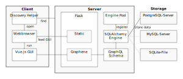

hOLper Architecture
===================

Data Structure
--------------

* based on the IOF-XML standard
* sqlalchemy as ORM
* import/export other IOF XML-versions (current: 3.0, widely used: 2.0.3)

Event Configuration
~~~~~~~~~~~~~~~~~~~

Our goal is to support a wide range of competition formats and variants. Though some might require dedicated code for certain functionality,
the base data model should be flexible enough to allow all kinds of configurations of legs, courses, categories and their correlations.

Some special competiton formats are:

* DM Sprint, WMOC (heats, finals, categories)
* Thüringer 24h-OL (continuous relay with time limit, special rules, predefined set of courses)
* DCUP (5 person relay, 3 person relay)
* double sprint (1 person runs two races, time sum counts)
* team (base course, distribution controls, evaluation after all participents finished; possibly team sizes of 1)
* score (free control order, need all controls or time limit, controls with different point values possible, ranking based on time or points)
* idhm sprint relay (6 legs, every starter runs 2 legs)

This means we should include the following features:

* Splitting categories into subcategories with their own courses
* Different subcategories for different races with different distribution of starters
* Assigning courses per runner instead of per category
* Different leg configurations for different classes
* Courses with both fixed order controls and free order controls
* One Person may be assigned to multiple legs of a single race

Web Interface
-------------

* users only need a web browser
* Vue.js GUI
* API: GraphQL
* but: dedicated software for hardware access (read-out)

